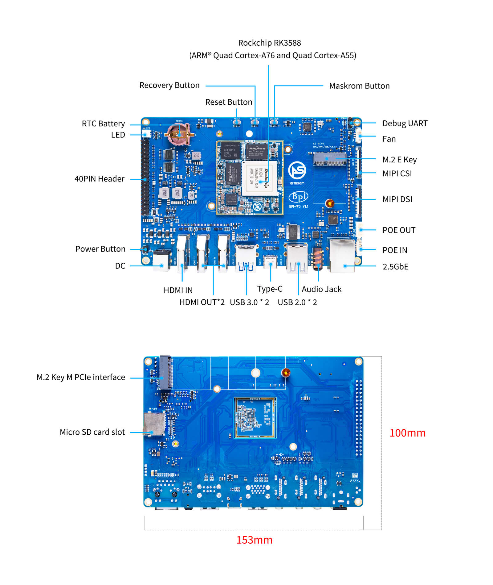

## Rockchip RK3588 Development Board Introduction

### ArmSoM-Sige7 RK3588 Development Board

The ArmSoM-Sige7 is powered by Rockchip's latest flagship RK3588,octa-core 64-bit processor, with a max frequency of 2.4GHz, a 6 TOPS NPU, and up to 32GB of RAM.

More details：https://docs.armsom.org/armsom-sige7

### ArmSoM-LM7 RK3588 SOM/Cord board

The ArmSoM-LM7 adopts Rockchip's latest flagship RK3588 which is eight-core 64-bit processor with a maximum frequency of up to 2.4GHz and a 6 TOPS NPU. It supports up to 32GB of large memory.

Supports 8K video encoding and decoding,with LGA packaging for stronger transmission capability and stability.

More details：https://docs.armsom.org/armsom-lm7

### Product Certificate

### RK3588 Linux mainline support

- Add rk3588 armsom-sige7 board: https://lore.kernel.org/linux-arm-kernel/171320634163.4714.8795054686718423617.robh@kernel.org
- Add rk3588 armsom-lm7 board: https://patchwork.kernel.org/project/linux-rockchip/list/?series=891223

## RK3588 Brief datasheet

A high performance, low power AloT processor

<table>
    <thead>
        <tr>
            <th>Features</th>
            <th>RK3588</th>
        </tr>
    </thead>
    <tbody align="left">
        <tr>
            <th>CPU</th>
            <th>
                <li>Quad-core ARM Cortex - A75 and quad-core ARM Cortex - A55 processors</li>
                <li>For each Cortex - A76: 64KB L1 instruction cache, 64KB L1 data cache, and 512KB L2 cache</li>
                <li>For each Cortex - A55: 32KB L1 instruction cache, 32KB L1 data cache, and 128KB L2 cache</li>
                <li>Big cluster and little cluster share 3MB L3 cache</li>
                <li>MCU for low power control</li>
            </th>
        </tr>
        <tr>
            <th>GPU</th>
            <th>
                <li>ARM Mali - G610MC4</li>
                <li>Supports OpenGL ES 1.1, 2.0, and 3.2, OpenCL 2.2, Vulkan 1.2, etc.</li>
                <li>Embedded with 4 shader cores and shared hierarchical tiler</li>
            </th>
        </tr>
        <tr>
            <th>NPU</th>
            <th>
                <li>6 TOPS @int8</li>
                <li>Supports int4/int8/int16/FP16/BF16/TF32</li>
                <li>Supports deep learning frameworks like TensorFlow, Caffe, Tflite, Pytorch, Onnx NN, Android NN, etc.</li>
            </th>
        </tr>
        <tr>
            <th>Memory</th>
            <th>
                <li>54bit LPDDR4/LPDDR4x/LPDDR5</li>
                <li>Supports eMMC5.1 with HS400, SDIO3.0 with HS200, NMe, SFC</li>
            </th>
        </tr>
        <tr>
            <th>Multimedia</th>
            <th>
                <li>H.265/H.264/VP9/AVI/AVS2 video decoder, up to 8K@60fps</li>
                <li>H.264 AVC/MVC Main10 L5.0: 8K@30fps (7680x4320)</li>
                <li>VP9 Profile0/2 L6.1: 8K@60fps (7680x4320)</li>
                <li>AVS2 Profile0/2 L10.2.6: 8K@60fps (7680x4320)</li>
                <li>AV1 Main Profile 8/10bit L5.3: 4K@60fps (3840x2160)</li>
                <li>1080P other video decoders (1, MPEG - 1/2/4, VP3, AVS1)</li>
                <li>HDCP 2.x for HDMI and DP/eDP</li>
                <li>MPEG - 1 up to MP: 1080p@60fps (1920x1080)</li>
                <li>MPEG - 2 up to MP: 1080p@60fps (1920x1080)</li>
                <li>VC - 1 up to AP level 3: 1080p@50fps (1920x1080)</li>
                <li>VP8 version2: 1080p@60fps (1920x1080)</li>
                <li>8K@30fps video encoders for H.264/H.265</li>
            </th>
        </tr>
        <tr>
            <th>Video Input</th>
            <th>
                <li>48M Pixel ISP with HDR&3DNR</li>
                <li>Multiple (4×4lanes or 4×2lanes + 2×4Lanes) MIPI CSI - 2 and DVP interface</li>
                <li>HDMI 2.0input to 4K@60fps</li>
            </th>
        </tr>
        <tr>
            <th>Display</th>
            <th>
                <li>Multiple display engine max to 8K</li>
                <li>Dual HDMI2.1/eDP V1.4 Combo interface</li>
                <li>Dual MIPI - DSI TX, 4 lanes</li>
                <li>Dual DP v1.3 embed in USB 3.1, Audio, HDCP2.x</li>
            </th>
        </tr>
        <tr>
            <th>Audio Interface</th>
            <th>
                <li>12S0/12S1 with 8 channels</li>
                <li>12S2/12S3 with 2 channels</li>
                <li>SPDIF0/SPDIF1</li>
                <li>PDMO/PDM1 with 8 channels</li>
                <li>Digital Audio Codec with 2 channels</li>
                <li>VAD (Voice Activity Detection)</li>
            </th>
        </tr>
        <tr>
            <th>High Speed Interface</th>
            <th>
                <li>Dual port USB3.1 with typeC& DP</li>
                <li>Dual port USB2.0 OTG &dual port USB2.0 host</li>
                <li>PCIe 3.0, 4 lanes or 2×2 lanes or 4×1lane</li>
                <li>Three port PCIe 2.0/SATA 3.0</li>
                <li>Dual RGMII interface</li>
            </th>
        </tr>
        <tr>
            <th>Industry</th>
            <th>
                <li>2x CAN FD</li>
                <li>16-bit DSMC (Double Data Rate Serial Memory Controller)</li>
            </th>
        </tr>
        <tr>
            <th>Security</th>
            <th>
                <li>ARM Trustzone security extension</li>
                <li>Secure boot</li>
            </th>
        </tr>
        <tr>
            <th>SDK</th>
            <th>
                <li>Linux 5.10</li>
                <li>Android 12</li>
            </th>
        </tr>
        <tr>
            <th>Others</th>
            <th>
                <li>Package: FCBGA108BL Body. 23mm x 23mm</li>
                <li>Ball pitch: 0.55mm</li>
            </th>
        </tr>
    </tbody>
</table>

### RK3588 Block Diagram

### RK3588 Typical Application Diagram-AloT

